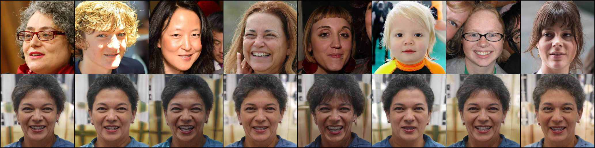
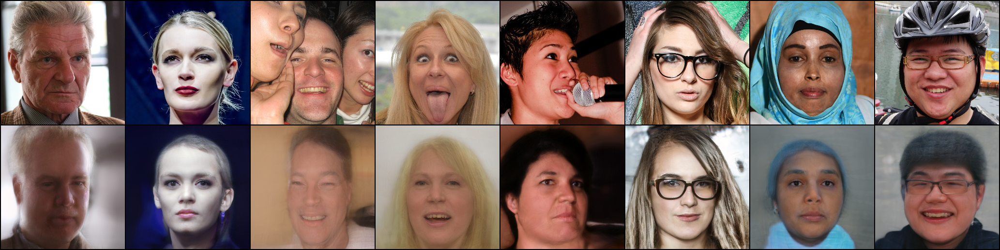
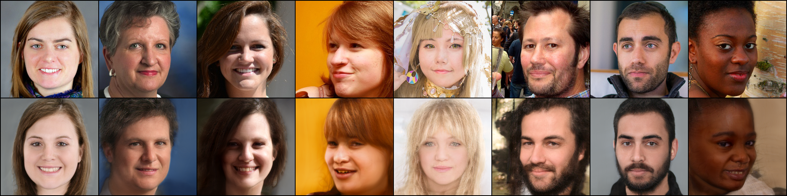
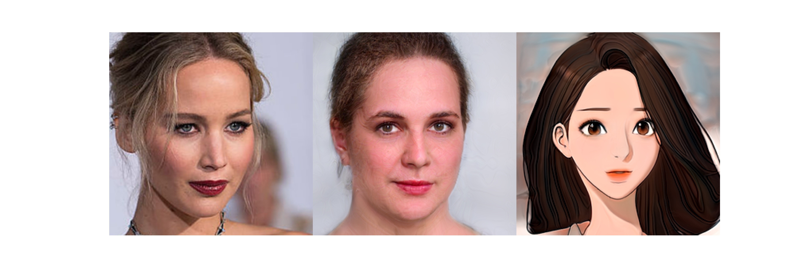
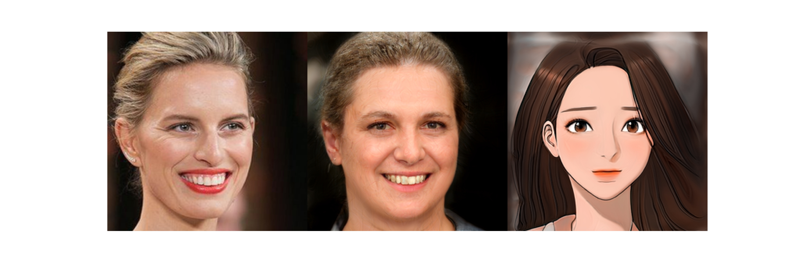
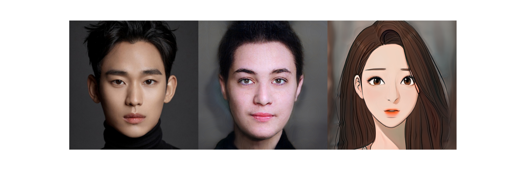

# Alias-Free-GAN Encoder

This repo was heavily based on the implementation of [rosinality](https://github.com/rosinality/alias-free-gan-pytorch) and [bryandlee](https://github.com/bryandlee/stylegan2-encoder-pytorch).


**related paper**
- [Alias-Free Generative Adversarial Networks](https://arxiv.org/abs/2106.12423) (2021)
- [In-Domain GAN Inversion for Real Image Editing](https://arxiv.org/abs/2004.00049) (ECCV 2020)


## Pre-trained Models

| Generator | Encoder | Generator(Jugyeong) |
| :-------- | :-------- | :-------- | 
| [`rosinality/ffhq-800k`](https://www.dropbox.com/s/ydqw5pb6cu7trxt/config-t_800k.pt?dl=0) | [`encoder-250k`](https://drive.google.com/file/d/17mwABMONSQfTj2fpgiFdAPd6giXAGBi3/view?usp=sharing) | [`jugyeong-30k`](https://drive.google.com/file/d/1ROTZDv0HaHS-brbkghh7tKD8PurLtDR1/view?usp=sharing) | 

### Training

```bash
python3 train_encoder.py --g_ckpt ffhq-800k.pt [ffhq lmdb path]
```


😊 You can do the Inference in Colab : [](https://colab.research.google.com/github/happy-jihye/alias-free-gan-encoder/blob/main/latent-optimize.ipynb)

**0k**
<p align='center'></p>

**25k**
<p align='center'></p>
<p align='center'></p>

## with Jugyeong Characters

<p align='center'></p>
<p align='center'></p>
<p align='center'></p>

<p align='center'></p>

